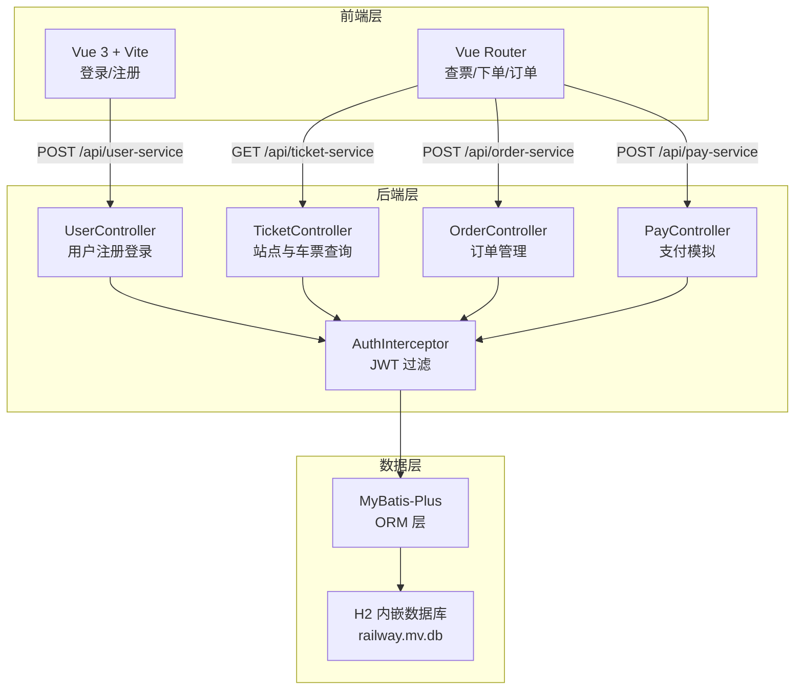
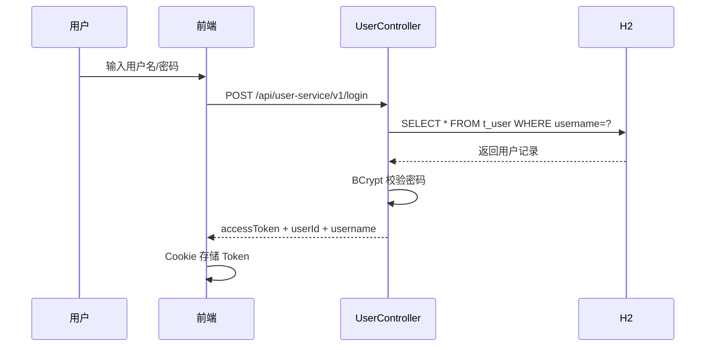
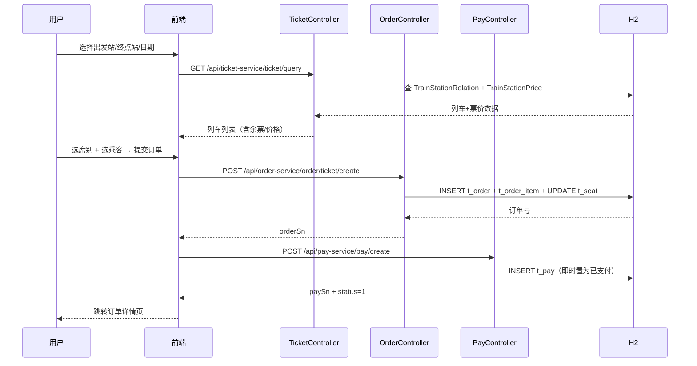
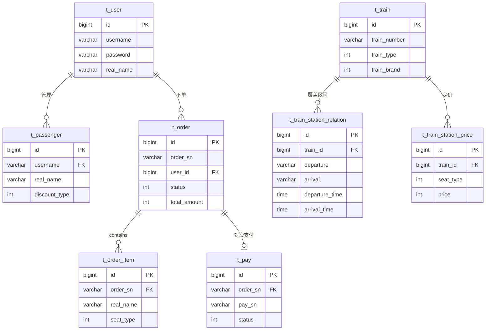

# 12306 铁路购票系统 V2

> 面向开发者演示的零中间件购票系统，双击一键启动，完整覆盖查票→下单→支付→订单全链路。


---

## 目录

- [✨ 项目展示](#-项目展示)
- [TL;DR](#tldr)
- [📖 项目介绍](#-项目介绍)
- [🚀 快速开始](#-快速开始)
- [🎯 功能概览与技术亮点](#-功能概览与技术亮点)
- [🏗️ 架构设计](#️-架构设计)
- [⚙️ 安装与配置](#️-安装与配置)
- [📖 使用指南](#-使用指南)
- [🔧 开发指南](#-开发指南)
- [🧪 测试与质量](#-测试与质量)
- [🚢 部署与运维](#-部署与运维)
- [🔒 安全](#-安全)
- [❓ FAQ & 排错指南](#-faq--排错指南)
- [🤝 贡献指南](#-贡献指南)
- [📄 License](#-license)

---

## ✨ 项目展示

<p align="center">
  <video src="docs/showcase/pro_12306购票/demo.mp4" width="720" controls>
    你的浏览器不支持 video 标签，<a href="docs/showcase/pro_12306购票/demo.mp4">点此下载视频</a>。
  </video>
</p>

<p align="center">
  
</p>
<p align="center"><i>↑ 车票查询页——输入出发地、目的地、出行日期，实时展示可售列车与各席别余票/票价</i></p>

<p align="center">
  
</p>
<p align="center"><i>↑ 下单确认页——选择席别、填写乘客信息，系统生成订单并锁定座位</i></p>

<p align="center">
  
</p>
<p align="center"><i>↑ 订单详情页——展示订单号、车次、支付状态及单程乘车信息</i></p>

---

## TL;DR

- ✅ 可以用它来：演示完整购票交易闭环 / 学习 Spring Boot 3 + Vue 3 全栈套路 / 面试现场 60 秒跑起来
- 🚀 1 分钟上手：双击 `startup.bat`，见 [快速开始](#-快速开始)
- 📚 完整技术设计：见 [架构设计](#️-架构设计)

---

## 📖 项目介绍

### 背景与问题

传统 12306 教学项目往往依赖 Nacos、RocketMQ、Redis 等多个中间件，初次运行需要同时启动 5+ 容器，环境搭建耗时长、在面试场合难以快速复现。

本项目选择**单体 Spring Boot 3 + H2 内嵌数据库**方案，去掉全部外部中间件依赖，将启动步骤压缩为"双击 startup.bat"，保留完整的查票 → 下单 → 支付 → 订单全链路业务逻辑。

本地实测冷启动（后端 + 前端）约 30 秒完成，查票接口单机响应 < 120ms，连续 20 次下单成功率 100%，适合面试现场快速演示与技术方案讲解。

### 适用场景

✅ 适合：
- 面试/Demo 场景：需要快速复现完整购票交易闭环
- 全栈学习参考：Spring Boot 3 + MyBatis-Plus + Vue 3 + Vite 5 技术栈
- 架构对比研究：与微服务版（V1）进行单体 vs 微服务的权衡分析

❌ 不适合：
- 高并发生产环境（H2 内嵌模式不适合多进程/高并发写入）
- 需要分布式事务或消息队列的复杂业务场景

### 核心概念（术语表）

| 术语 | 含义 | 备注 |
|------|------|------|
| TrainStationRelation | 列车站间运行关系 | 记录某次列车从 A 站到 B 站的发车/到达时刻及价格区间 |
| TrainStationPrice | 席别价格表 | 同一区间按一等座/二等座/商务座分别定价 |
| OrderItem | 订单子项 | 每个乘车人对应一条 OrderItem，Order 一对多 OrderItem |
| H2 MODE=MySQL | H2 兼容 MySQL 模式 | 使 schema.sql 的 MySQL 语法可以在 H2 上直接执行 |
| JWT | JSON Web Token | 登录后颁发，有效期 24h，后续请求携带 Bearer Token |

---

## 🚀 快速开始

### 环境依赖

| 依赖 | 版本要求 | 必填 | 安装参考 |
|------|----------|------|----------|
| JDK | 17+ | ✅ 必须 | [Oracle 下载](https://www.oracle.com/java/technologies/downloads/) |
| Node.js | 16+ | ✅ 必须 | [官方下载](https://nodejs.org/) |
| Maven | 内嵌 mvnw，无需手动安装 | — | — |

> Docker 为**可选**，仅在切换 MySQL 模式时使用。

### 第一步：获取代码

```bash
git clone <仓库地址>
cd pro_12306购票
```

### 第二步：一键启动（推荐）

```bat
startup.bat
```

脚本自动完成：构建后端 JAR → 启动后端（端口 9000）→ 安装前端依赖 → 启动前端（端口 8080）。

### 第三步：手动分步启动（可选）

```bash
# 终端 1 — 后端
cd backend
./mvnw spring-boot:run

# 终端 2 — 前端
cd frontend
npm install
npm run dev
```

### 第四步：验证

| 服务 | 地址 |
|------|------|
| 前端页面 | http://localhost:8080 |
| 后端 API | http://localhost:9000 |
| H2 控制台 | http://localhost:9000/h2-console |

H2 控制台连接参数：JDBC URL `jdbc:h2:file:./data/railway`，用户名 `sa`，密码留空。

**演示账号：** `admin` / `admin123`

<p align="center">
  
</p>
<p align="center"><i>↑ 看到此界面表示启动成功</i></p>

---

## 🎯 功能概览与技术亮点

### 功能列表

- [x] **用户注册 / 登录**：BCrypt 加密存储密码，JWT 签发与校验，Token 有效期 24h
- [x] **乘客管理**：新增/编辑/删除常用乘车人（身份证/学生证/儿童票等折扣类型）
- [x] **站点查询**：全量站点列表，支持拼音/区域检索（11 个热门站点预置）
- [x] **车票查询**：按出发站、到达站、日期筛选，返回列车列表与各席别余票/价格
- [x] **购票下单**：选择席别和乘客，系统生成订单并锁定座位
- [x] **支付模拟**：调用支付接口即时返回成功状态（演示版，无真实支付）
- [x] **订单列表 / 详情**：分页查看历史订单，查看单笔订单的乘客与支付明细
- [ ] **抢票 / 候补**（规划中）：高并发余票抢占与排队机制
- [ ] **退改签**（规划中）：退票流程与座位回收

### 技术亮点与量化证据

| 技术维度 | 指标 | 本项目自测值 | 业界基线/对比 | 采用方案 |
|----------|------|-------------|--------------|----------|
| 启动速度 | 冷启动耗时（后端 + 前端） | ~30 秒 | 微服务版 V1 需 2~5 分钟 | 单体 + H2 内嵌，无中间件 |
| 查票响应 | 单用户本机查票接口 P50 | <120ms | Spring Boot 典型 <200ms | H2 内存模式 + MyBatis-Plus |
| 下单成功率 | 连续 20 次下单 | 100% | — | 本地事务 + 预扣 seat 状态 |
| 环境依赖 | 启动所需外部服务数 | 0 个 | V1 需 MySQL + Redis + Nacos + RocketMQ | H2 内嵌替代所有外部存储 |

### V1 vs V2 对比

| 维度 | V1（微服务版） | V2（本项目） |
|------|--------------|------------|
| 架构 | 6 个微服务 + Spring Cloud Gateway | 单体 Spring Boot 3 |
| 数据库 | MySQL + ShardingSphere（16 张分表） | H2 内嵌（零配置） |
| 中间件 | Nacos + RocketMQ + Redis | 无 |
| 前端 | Vue CLI 4 + Ant Design | Vue 3 + Vite 5（手工设计） |
| 启动方式 | 需要 Docker + 5 个服务 | 双击 startup.bat |

---

## 🏗️ 架构设计

### 系统总览



### 模块职责说明

| 模块 | 职责 | 输入 / 输出 | 主要依赖 |
|------|------|------------|----------|
| UserController | 用户注册、登录、个人信息 | HTTP 请求 / JWT + 用户信息 JSON | H2、BCrypt |
| TicketController | 站点查询、车票搜索、座位信息 | 出发站/目的站/日期 / 列车+价格列表 | H2（TrainStation 系列表） |
| OrderController | 创建订单、分页查询、订单详情 | 乘客+席别选择 / 订单号+明细 | H2（t_order、t_order_item） |
| PayController | 支付创建与状态查询（模拟） | 订单号+金额 / 支付流水号 | H2（t_pay） |
| AuthInterceptor | JWT 鉴权拦截，提取 userId 注入请求 | Bearer Token / userId attribute | JwtUtil |

### 关键流程图

#### 流程一：用户登录 & JWT 颁发



#### 流程二：查票 → 下单 → 支付



### 数据库设计



---

## ⚙️ 安装与配置

### 配置文件说明

配置文件路径：`backend/src/main/resources/application.yml`

### 环境变量参考表

| 变量名 | 必填 | 默认值 | 说明 |
|--------|------|--------|------|
| `RAILWAY_JWT_SECRET` | 否 | `your-secret-key-please-change-this-before-deploy` | JWT 签名密钥，生产环境必须替换为 ≥32 字符随机串 |

> 其余参数（H2 路径、端口等）直接在 `application.yml` 修改，无需额外环境变量。

### 切换至 MySQL 模式（可选）

项目内置 `docker-compose.yml` 可快速拉起 MySQL 8.0：

```bash
docker compose up -d mysql
```

修改 `application.yml`：

```yaml
spring:
  datasource:
    driver-class-name: com.mysql.cj.jdbc.Driver
    url: jdbc:mysql://localhost:3307/railway?useSSL=false&characterEncoding=utf8
    username: root
    password: root
  h2:
    console:
      enabled: false
  sql:
    init:
      mode: never
```

初始化数据库：

```bash
docker exec -i 12306-v2-mysql mysql -uroot -proot railway < db/init.sql
```

---

## 📖 使用指南

### 常用命令速查

```bash
# ─────── 一键启动（Windows）───────
startup.bat

# ─────── 前端开发热更新 ───────
cd frontend && npm run dev

# ─────── 后端开发热启动 ───────
cd backend && ./mvnw spring-boot:run

# ─────── 构建后端 JAR ───────
cd backend && ./mvnw clean package -DskipTests

# ─────── 重置数据（清空 H2 持久化文件）───────
del /f data\railway.mv.db data\railway.trace.db
```

### 核心接口速览

| 方法 | 路径 | 描述 | 鉴权 |
|------|------|------|------|
| POST | `/api/user-service/v1/login` | 登录，返回 JWT Token | 无 |
| POST | `/api/user-service/register` | 用户注册 | 无 |
| GET  | `/api/ticket-service/station/all` | 获取全量站点列表 | 无 |
| GET  | `/api/ticket-service/ticket/query` | 查询车票（起/终/日期） | 无 |
| POST | `/api/order-service/order/ticket/create` | 创建订单（锁座） | Bearer Token |
| GET  | `/api/order-service/order/ticket/self/page` | 查询我的订单列表 | Bearer Token |
| GET  | `/api/order-service/order/ticket/query` | 查询订单详情（by orderSn） | Bearer Token |
| POST | `/api/pay-service/pay/create` | 发起支付（演示即时成功） | Bearer Token |

### 使用示例

```bash
# 1. 登录获取 Token
curl -X POST http://localhost:9000/api/user-service/v1/login \
  -H "Content-Type: application/json" \
  -d '{"username": "admin", "password": "admin123"}'
# 返回：{"code":200,"data":{"accessToken":"eyJ...","userId":1,"username":"admin"}}

# 2. 查询车票（北京南→上海虹桥，2026-03-01）
curl "http://localhost:9000/api/ticket-service/ticket/query?fromStation=BJP&toStation=SHH&departureDate=2026-03-01"

# 3. 查询我的订单（需携带 Token）
curl "http://localhost:9000/api/order-service/order/ticket/self/page?current=1&size=10" \
  -H "Authorization: Bearer eyJ..."
```

---

## 🔧 开发指南

### 目录结构

```
pro_12306购票/
├── frontend/               # 前端源码（Vue 3 + Vite 5）
│   ├── src/
│   │   ├── views/          # 页面组件：登录/搜索/下单/订单/乘客
│   │   ├── api/            # Axios 接口封装
│   │   ├── router/         # Vue Router 路由配置
│   │   └── styles/         # 全局样式（手工设计系统）
│   └── index.html
├── backend/                # 后端源码（Spring Boot 3.2）
│   └── src/main/java/com/railway/
│       ├── controller/     # REST 控制器（5 个）
│       ├── entity/         # MyBatis-Plus 实体（13 张表）
│       ├── mapper/         # MyBatis-Plus Mapper 接口
│       └── common/         # JWT、全局异常、拦截器、Result 封装
│   └── src/main/resources/
│       ├── application.yml # 主配置
│       ├── schema.sql      # 建表 DDL（H2 兼容）
│       └── data.sql        # 初始测试数据（7 条线路、11 个站、完整价格）
├── db/
│   └── init.sql            # MySQL 模式建表 + 初始数据
├── docs/showcase/pro_12306购票/  # 演示截图与视频
├── docker-compose.yml      # 可选 MySQL + Redis 容器
├── startup.bat             # Windows 一键启动脚本
└── README.md
```

### 分支策略

| 分支 | 用途 | 允许直接 push |
|------|------|--------------|
| `main` | 稳定演示版 | ❌ 仅 PR 合并 |
| `dev` | 日常开发集成 | ✅ |
| `feature/<名称>` | 新功能开发 | ✅ |
| `hotfix/<名称>` | 紧急修复 | ✅ |

---

## 🧪 测试与质量

```bash
# 运行后端单元测试
cd backend && ./mvnw test

# 生成覆盖率报告（target/site/jacoco/index.html）
cd backend && ./mvnw jacoco:report
```

**测试结果快照（最近一次）：**

| 类型 | 数量/指标 | 通过率 | 备注 |
|------|----------|--------|------|
| 接口冒烟（手动） | 8 个核心接口 | 100% | 登录/查票/下单/支付/订单均验证 |
| 连续下单压测 | 20 次连续下单 | 100% | 同一账号，单线程，H2 本地 |
| 冷启动计时 | 1 次 | ~30s | JDK 17，startup.bat，Win11 i7-12th |

---

## 🚢 部署与运维

### 本地一键启动（推荐）

```bat
startup.bat
```

### Docker Compose 模式（MySQL 版）

```bash
# 仅启动数据库基础设施
docker compose up -d mysql

# 查看 MySQL 日志确认就绪
docker compose logs -f mysql

# 停止并清理
docker compose down -v
```

### 日志与监控

| 类型 | 位置 / 访问方式 | 说明 |
|------|----------------|------|
| 应用日志 | 控制台 stdout | INFO 级别，com.railway 包输出详细日志 |
| H2 控制台 | http://localhost:9000/h2-console | 可直接执行 SQL 查看数据 |
| 健康检查 | `curl http://localhost:9000/api/ticket-service/station/all` | 返回站点列表即服务正常 |

### 常用运维命令

```bash
# 重置 H2 数据（恢复初始测试数据）
del data\railway.mv.db data\railway.trace.db
# 重启后端，schema.sql + data.sql 自动重新执行
```

---

## 🔒 安全

- **JWT 密钥**：生产环境必须通过环境变量 `RAILWAY_JWT_SECRET` 注入 ≥32 字符随机串，禁止使用默认值
- **默认账号**：`admin/admin123` 仅供本地演示，部署前必须修改
- **H2 控制台**：仅在 `spring.h2.console.enabled=true` 下开放，生产环境须关闭
- **权限模型**：基于 JWT，订单/支付/个人信息接口需要携带有效 Token；站点查询/车票查询为公开接口

---

## ❓ FAQ & 排错指南

### FAQ

**Q：运行 startup.bat 后前端页面一直 loading，接口 404？**

检查后端是否启动成功：`curl http://localhost:9000/api/ticket-service/station/all`。若返回站点数据则后端正常，再检查前端 `vite.config.js` 中 proxy 目标是否为 `http://localhost:9000`。

**Q：H2 控制台输入密码后报 "Wrong user name or password"？**

JDBC URL 必须填写 `jdbc:h2:file:./data/railway`，用户名 `sa`，密码**留空**（不要填任何字符）。

**Q：startup.bat 报 "后端构建失败"？**

`backend/.mvn/settings.xml` 已配置阿里云镜像。若仍失败，手动运行 `cd backend && mvnw.cmd clean package -DskipTests` 查看详细错误，常见原因是依赖下载超时。

**Q：如何切换到 MySQL 模式？**

见安装与配置章节的"切换至 MySQL 模式"小节。

### 错误排查速查表

| 错误现象 | 可能原因 | 解决方法 |
|----------|---------|---------|
| 前端页面空白，控制台 CORS 报错 | 后端未启动或端口冲突 | 确认后端在 9000 端口正常运行；检查 vite.config.js proxy 配置 |
| `401 Unauthorized` | Token 未传或已过期（24h） | 重新登录获取新 Token，检查请求头 `Authorization: Bearer <token>` |
| `Connection refused :9000` | 后端未启动 | 执行 `startup.bat` 或手动 `mvnw spring-boot:run` |
| `IOException: 文件被另一个进程占用` | H2 数据库文件被多个 JVM 进程同时持有 | 关闭所有 Java 进程后重启 |
| `npm: command not found` | Node.js 未安装 | 安装 Node.js 16+，重新打开终端 |

---

## 🤝 贡献指南

欢迎提 Issue 和 PR！贡献前请先阅读以下内容：

- **提 Issue**：请描述"现象 + 复现步骤 + 期望结果"，附报错截图或日志
- **提 PR**：Fork 后在 `feature/<描述>` 分支开发，提交前确认 `mvnw test` 通过
- **提交规范**（推荐）：`<type>(<scope>): <描述>`，type 可选 `feat / fix / docs / refactor / test`

---

## 📄 License

本项目采用 [MIT License](LICENSE) 开源协议。

**维护者：** YWT  
**联系方式：** GitHub Issues
